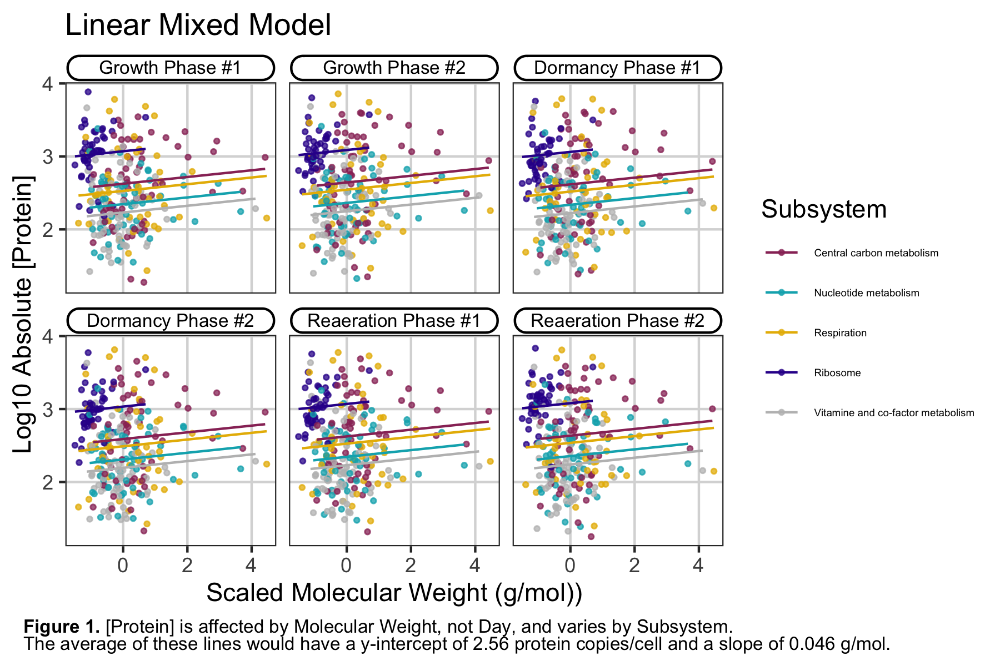

# Statistical Modeling
Three distinct statistical modeling projects were devised using data from an [*Mycobacterium tuberculosis* proteomics study](https://doi.org/10.1016/j.chom.2015.06.001)1.     

## Projects
Project | Statistical Model | Test/Analysis
------------ | ------------- | -------------
Linear Mixed Modeling | Multiple Regression Model | Type II Wald Chi-square test,  Restricted maximum likelihood (REML)
Multivariate Analysis | None | Principal Component Analysis
Univariate Analysis | Linear Model | ANOVA, posthoc pairwise t-tests,  Bonferroni correction

## 1) Linear Mixed Modeling
A linear mixed model was created for proteins in five different subsystems with similar sample sizes (Central carbon metabolism, Nucleotide metabolism, Respiration, Ribosome, Vitamine and co-factor metabolism). The linear mixed model was used to evaluate:

**Fixed Effects**: Do protein molecular weight and stage of infection significantly affect the mass spec. measurement of absolute protein concentration?

**Random Effects**: Does subsystem classification explain some degree of variation in the data?

Poisson modeling was ruled out due to the nature of the data - absolute protein concentrations are fractional whereas Poisson modeling requires integer data. Individual regression analysis was ruled out due to a reduction in statistical power - 50 parameters would need to be estimated ((y-intercept + slope) * 5 Days * 5 Subsystems) and the error would increase due to multiple hypothesis testing.

**Conclusion:** Overall, Type II Wald chisquare tests revealed that the average molecular weight for proteins in a given subsystem significantly affected average absolute [protein] (Chisq = 12.71, df = 1, p-value < 0.001) whereas the stage of infection did not (Chisq = 2.24, df = 5, p-value = 0.815). Furthermore, subsystem classification accounted for 33% of the residual/unexplained variation whereas the remaining 67% can be explained by fixed effects. These results are summarized in Figure 1.

## 2) Multivariate Analysis
To determine which stages of infection cluster together based on ordination distances (Euclidean and Manhattan) and principal component analysis, Log2-FC protein expression values (vs. Day 0, centered and scaled) were subject to singular value decomposition. Also, individual loading scores were calculated to identify which proteins were most responsible for the clustering (i.e. those that produce the most variation between stages).

**Conclusion:** The original paper referred to three stages of infection - normoxia (normal oxygen levels), hypoxia (low oxygen level), and reaeration (low to normal oxygen levels). Based on Figure 2, it may be better to redefine the three stages as four stages - normoxia (d00, d05), early hypoxia (d10), late hypoxia (d20, d20.06), and reaeration (d20.48).

**PC1 Proteins (most influential)**: Rv2826c, Rv1342c, Rv2771c, Rv0073, Rv1891, and Rv1004c
- all PC1 proteins are uncharacterized/of unknown function

**PC2 Proteins (most influential)**: Rv0251c (heat shock protein), Rv1984c (carboxylesterase), Rv2007c (ferrodoxin)

## 3) Univariate Analysis
One-way ANOVA and post-hoc t-tests were conducted with a linear model to determine if three different classes of enzymes (oxidoreductases, transferases, and hydrolases) have significantly different turn-over rates (Kcats) in *M. tuberculosis*.

**Hypothesis**:
- Mean Kcat values in EC class #1 (oxidoreductases) > EC class #3 (hydrolases) > EC class #2 (transferases)

Reasoning: Assuming the enzyme turn-over rate is inversely related to the size of the transferred group from one substrate to another, the EC class that transfers the smallest group should have the greatest mean Kcat value. Because oxidoreductases transfer the smallest group, either a single atom (H or O) or an electron, they should have the greatest mean Kcat value. This is followed by hydrolases, which transfer protons and hydroxy groups from water, and then by transferases, which move functional groups larger than water.

**Conclusion:** Kcat values were log10-transformed so residuals met the linear modeling assumptions of homoscedasticity and normal distribution. ANOVA revealed that mean Kcat values in EC classes 1, 2, and 3 significantly differed (F = 12, df = 2, 525, p-value < 0.0001). To determined the magnitude and direction of each difference between EC classes, post-hoc pairwise t-tests were run to obtain p-values. The resulting p-values were corrected for multiple hypothesis testing using the Bonferroni correction method.

As seen in Figure 3, my overall hypothesis was partially correct.
- **Hypothesis (Kcat): EC class 1 > EC class 3 > EC class 2**
- **Result (Kcat): EC class 1 = EC class 3 > EC class 2**

## Requirements 
R 3.6.2

The required R packages will be installed automatically the first time a script is run.

## References
1. Schubert, O. T. et al. Absolute Proteome Composition and Dynamics during Dormancy and Resuscitation of Mycobacterium tuberculosis. *Cell Host Microbe 18, 96–108* (2015).
